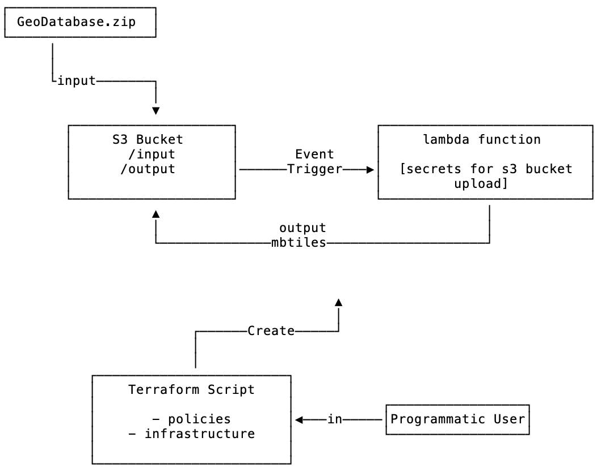

# Purpose

The goal of this codebase is to automate `mbtile` creation (from an ESRI File Geodatabase) using AWS as our infrastructure. The project aims to follow infrastructure as code best practices. See instructions below on it's components and how to use it:



## Components

The project has two main components

1. `Dockerfile` to create the image that is used to create a worker container on AWS during a job run. It primarily relies on `gdal` and `tippecanoe` to do the heavy lifting.
2. `Terraform` script that automates the creation of the infrastructure used to run the `mbtile` generation pipeline


## How to run the terraform script

Run:

```sh
cd terraform

# create and initialize the .terraform directory with the correct provider (e.g. AWS)
terraform init

# create a .env file with the appropriate values for the vars (please see .env.example for reference)

# show the execution plan (analogous to --dry-run in other CLIs)
terraform plan

# execute the plan
terraform apply

# execute the plan and don't prompt
terraform apply --auto-approve
```

## How to build and test the worker container

```sh
# from the project root run the following to build the image and do a test conversion using the test fixtures:

docker build -f Dockerfile -t sabman/tippecanoe .

mkdir -p output

docker run -it -p 3000:3000 \
 -v `pwd`/fixtures:/opt/input \
 -v `pwd`/output:/opt/output sabman/tippecanoe:latest \
 /bin/bash -c "/opt/run_tippecanoe.sh /opt/input/filegeodatabase.gdb.zip /opt/output"
 ```


## Todos:

- [ ] In lambda_func/index.py, change script to shutdown the instance and ensure it terminates on shutdown (Line: 72)
- [ ] In lambda_func/index.py, send notification to user's email address on completion (Line: 73)

